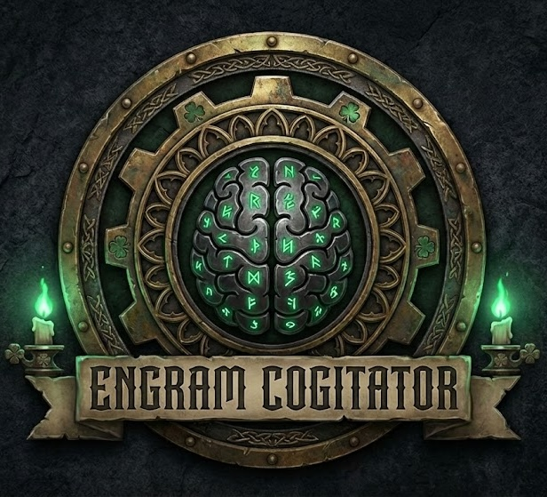

<p align="center">
  
</p>

<h1 align="center">Engram Cogitator</h1>

<p align="center">
  <em>The Machine Spirit remembers what you forget.</em><br>
  <em>(And unlike your da, it won't bring up that one time you dropped prod)</em>
</p>

<p align="center">
  Persistent semantic memory for Claude Code sessions.<br>
  By the grace of the Omnissiah, your decisions shall not be lost to the warp.
</p>

---

## The Sacred Rites of Installation

```bash
curl -sSL https://raw.githubusercontent.com/MereWhiplash/engram-cogitator/main/install.sh | bash
```

**Prerequisites:** Docker daemon running (the good kind of daemon, not the Chaos kind), Claude Code CLI installed. Offer a prayer to the Machine Spirit (optional but recommended). Cup of tea (mandatory if Irish).

## What It Does

The Engram Cogitator serves as an auxiliary memory core for your Claude Code sessions. Like a good Irishman's grudge, it never forgets. It stores:

- **Decisions** - Sacred architectural choices (why X over Y)
- **Learnings** - Hard-won knowledge extracted from the codebase (the stuff that made you say "ah for feck's sake")
- **Patterns** - The recurring litanies of your craft

All memories are searchable by semantic similarity using local embeddings (Ollama + nomic-embed-text). No data leaves your machine - the Inquisition need not be concerned, and sure GDPR is grand.

## MCP Tools (The Four Holy Functions)

| Tool            | Purpose                                                                             |
| --------------- | ----------------------------------------------------------------------------------- |
| `ec_add`        | Commit a memory to the cogitator's data-stacks                                      |
| `ec_search`     | Query the machine spirit for relevant wisdom                                        |
| `ec_list`       | Enumerate recent memory engrams                                                     |
| `ec_invalidate` | Perform the Rite of Deletion (soft-delete, like how you "deleted" your ex's number) |

## Manual Setup (For the Truly Devoted)

If the sacred curl script fails you (sure it'll be grand):

```bash
# 1. Create the holy network
docker network create engram-network

# 2. Awaken the Ollama spirit
docker run -d --name engram-ollama \
  --network engram-network \
  -v ollama_data:/root/.ollama \
  ollama/ollama:latest

# 3. Download the embedding model (the nomic rites)
docker exec engram-ollama ollama pull nomic-embed-text

# 4. Construct the cogitator (patience, Tech-Priest)
docker build -t engram-cogitator:local .

# 5. Anoint the MCP configuration
claude mcp add --transport stdio engram-cogitator \
  --scope project \
  -- docker run -i --rm \
  --network engram-network \
  -v "$(pwd)/.claude:/data" \
  engram-cogitator:local \
  --db-path /data/memory.db \
  --ollama-url http://engram-ollama:11434

# 6. Restart Claude Code (the machine must be reborn)
```

## Troubleshooting (Appeasing the Machine Spirit)

### "readonly database" error

The data-shrine lacks proper permissions. The Machine Spirit is having a mare:

```bash
chmod 777 .claude
rm .claude/memory.db  # Let the cogitator rebuild its engrams
```

### "Dimension mismatch" error

The embedding vectors are misaligned. Like trying to fit a Dreadnought through a hobbit door. Purge and reconstruct:

```bash
rm .claude/memory.db
```

### MCP server not showing up

The config must reside in `.mcp.json` (project root), not `.claude/mcp.json`. It's not hiding, you're just looking in the wrong place like your keys:

```bash
claude mcp list  # Should reveal engram-cogitator
```

### Alpine build failures

EC requires Debian-based images. Ensure your Dockerfile uses `golang:1.23-bookworm`. Alpine is heresy. The Omnissiah has spoken.

### Still not working?

Have you tried turning it off and on again? Seriously though, restart Claude Code. Works 60% of the time, every time.

## Development

```bash
# Run the sacred tests
CGO_ENABLED=1 go test ./...

# Forge the cogitator locally
docker build -t engram-cogitator:local .
```

---

<p align="center">
  <em>Praise the Omnissiah. Store your memories. Ship your code.</em><br>
  <em>The Emperor Protects, but version control saves.</em>
</p>

<p align="center">
  Made with mass-produced servitor love in Ireland 🇮🇪<br>
  <sub>Now stop reading READMEs and go build something, ya gobshite</sub>
</p>
